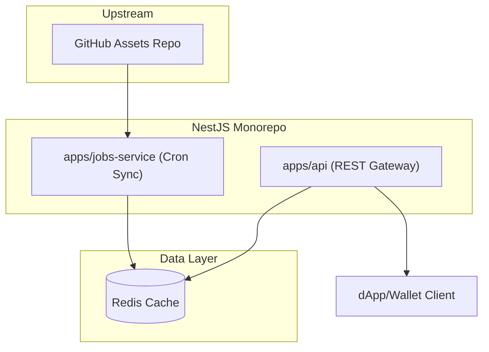

# MultiversX Assets CDN - API & Metadata Sync Monorepo

Unified REST API facade and background synchronization service for serving, proxying, and caching blockchain token, identity, and account metadata in the MultiversX ecosystem.

---

## 🚀 Quick start

1.  **Install Dependencies:**
    ```bash
    npm install
    ```
2.  **Environment Setup:**
    Copy the example environment file and configure your credentials:
    ```bash
    cp .env.example .env
    # Edit .env and configure GITHUB_TOKEN, REPO_OWNER, REPO_NAME, etc.
    ```
3.  **Start Services:**
    Start the Redis service required for caching and rate limiting:
    ```bash
    docker compose up -d
    ```

After running the service, you can shut down the container using:
```bash
docker compose down
```

---

## 📦 Dependencies

1.  **Redis Server:** Required for high-performance distributed caching and rate-limiting states. You can spin up a local instance easily via the included `docker-compose.yml`.
    *   *Fallback Mode:* If Redis is unavailable or offline, the monorepo gracefully falls back to using an optimized local memory cache (with LRU-like capacity eviction) and standard memory rate-limit counters.

---

## 🏃 Running the App

This is a NestJS monorepo containing two operational services. You can start either in development watch mode or production mode.

### API REST Gateway (`apps/api`)
Provides high-performance public REST endpoints and serves the Swagger UI documentation portal.
*   **Development Mode:**
    ```bash
    npm run start-api
    ```
*   **Production Mode:**
    ```bash
    npm run start-api:prod
    ```
*   *Default Port:* [http://localhost:3201/assets-cdn](http://localhost:3201/assets-cdn)

### Metadata Synchronizer Service (`apps/jobs-service`)
Runs the periodic background cron jobs that sync token, account, and identity assets from the designated upstream GitHub repository.
*   **Development Mode:**
    ```bash
    npm run start-api:cron
    ```
*   **Production Mode:**
    ```bash
    npm run start-api:cron:prod
    ```

---

## 🧪 Testing

We ensure service reliability and performance via unit and load-test suites:

### Unit Tests
Executes Jest unit tests covering controllers, sanitization pipelines, cache layer, and fallback mechanisms:
```bash
npm run test:unit
```

### Load Tests (k6)
> [!NOTE]
> Ensure the API REST Gateway service is actively running (e.g., via `npm run start-api` or `npm run start-api:prod`) before starting the load tests.

Performs automated performance and load testing against the HTTP endpoints:
```bash
# Standard load test
npm run test:load

# Staged load test with simulated virtual users (VUs)
npm run test:load:staged
```

---

## 🏗️ Architecture & Microservice Modes

This project is structured as a robust NestJS Monorepo to separate public web-serving concerns from periodic background workloads.



### 1. REST API Gateway (`apps/api`)
A high-performance Express-based NestJS service that handles consumer traffic:
*   **Preloaded Universal Fallbacks:** Missing asset icons are automatically caught and resolved by serving pre-cached default vector/raster placeholders (`default.svg` and `default.png`) or 1x1 transparent PNG fallbacks, avoiding raw 404 responses.
*   **High-Performance Compression:** Utilizes middleware to compress REST responses (JSON, SVG metadata, etc.) while skipping pre-compressed PNG binary streams.
*   **Event-Loop Optimization:** Employs response size limiting (up to 10MB) and single-pass JSON stringification to prevent high event-loop blocking during large payload delivery.
*   **Interactive Swagger UI:** Hosts a dynamic Swagger documentation portal under `/assets-cdn` with dark mode support.

### 2. Metadata Synchronizer Service (`apps/jobs-service`)
A background synchronization microservice that keeps the cache populated:
*   **Background Cron Job:** Periodically synchronizes asset databases directly from the official MultiversX GitHub repository to avoid on-demand API rate-limiting delays.
*   **Adaptive Concurrency:** Implements a rate-throttler that adjusts concurrency limits (boosting from 5 up to 15 concurrent requests when a valid `GITHUB_TOKEN` is detected) to maximize throughput while avoiding upstream rate limit bans.

---

## 🔧 Configuration Reference

Behavior is managed using environment variables loaded from the `.env` file:

| Variable | Description | Default |
| :--- | :--- | :--- |
| `GITHUB_TOKEN` | Personal Access Token to avoid GitHub API rate limits (Recommended) | `""` |
| `PORT` | Listening port for the API REST Gateway service | `3201` |
| `ALLOWED_ORIGIN` | Allowed domains for CORS (comma-separated, `*` allows all) | `http://localhost:3200` |
| `ALLOWED_HOSTS` | Allowed host headers for security enforcement | `localhost,127.0.0.1` |
| `REPO_OWNER` | Upstream GitHub organization/owner of the assets | `""` |
| `REPO_NAME` | Upstream GitHub repository name containing assets | `""` |
| `BRANCH` | Repository branch to synchronize from | `"main"` |
| `REDIS_URL` | Redis connection URL | `redis://127.0.0.1:6379` |
| `REDIS_PASSWORD` | Optional Redis password | `""` |

---

## 🌐 API Endpoints Reference

### Health Checks
*   `GET /health` - Returns `{ "status": "ok" }` when the gateway is up.

### Accounts Collection
*   `GET /assets-cdn/:network/accounts` - Fetch all synchronized accounts.
*   `GET /assets-cdn/:network/accounts/:address` - Fetch metadata for a specific address.
*   `GET /assets-cdn/:network/accounts/:address/icon.png` - Fetch address PNG icon (with default fallback support).
*   `GET /assets-cdn/:network/accounts/:address/icon.svg` - Fetch address SVG icon (with default fallback support).

### Identities Collection
*   `GET /assets-cdn/:network/identities` - Fetch all synchronized identities.
*   `GET /assets-cdn/:network/identities/:identity` - Fetch metadata for a specific identity.
*   `GET /assets-cdn/:network/identities/:identity/icon.png` - Fetch identity PNG icon (with default fallback support).

### Tokens Collection
*   `GET /assets-cdn/:network/tokens` - Fetch all synchronized tokens.
*   `GET /assets-cdn/:network/tokens/:identifier` - Fetch metadata for a specific token identifier.
*   `GET /assets-cdn/:network/tokens/:identifier/icon.png` - Fetch token PNG icon.
*   `GET /assets-cdn/:network/tokens/:identifier/icon.svg` - Fetch token SVG icon.
